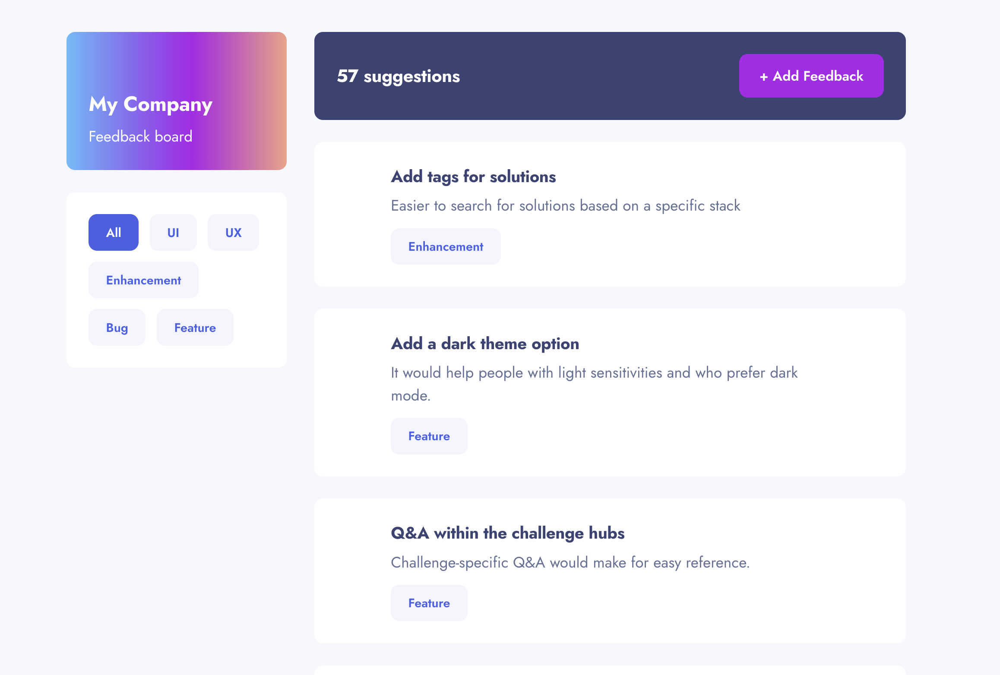

# 📝 My Project's Title - Product Feedback App

## 👋 Welcome!

## 📌 Project Description & Purpose

This project is a full-stack Product Feedback app where users can view suggestions, filter them by category, and submit new feedback.

The purpose of this project was to practice building a full-stack application by connecting a frontend to a backend API and storing real data in a database. It helped me understand how user input flows from the UI to the server, gets stored in a PostgreSQL database, and is then retrieved and displayed back on the frontend.

## 🚀 Live Site

Here’s the link to view the live app:
https://ainslie-product-feedback-app.netlify.app/ ✨

🖼️ Screenshots


## ✨ Features

This is what you can do on the app:
- View all product feedback suggestions
- Filter suggestions by category (UI, UX, Bug, Feature, Enhancement)
- Submit new feedback through a form
- Display a message when no feedback is available
- Form validation for required fields
- Responsive layout for different screen sizes

## 🛠️ Tech Stack

**Frontend**
 
 - **Languages:** JavaScript, HTML, CSS
- **Framework:** React
- **Deployment:** Netlify

**Server/API**

- **Languages:** JavaScript
- **Framework:** Express (Node.js)
- **Deployment:** Render

**Database**

 - **Languages:** SQL
 - **Deployment:** Neon (PostgreSQL)

## 🔹 API Documentation

These are the API endpoints I built:

1. GET /get-all-suggestions → returns all suggestions
2. GET /get-suggestions-by-category/:category → filters suggestions by category
3. POST /add-one-suggestion → adds a new suggestion

Here's the link to the full API documentation: https://github.com/AinslieF/product-feedback-app/blob/main/api-documentation.md

## 🗄️ Database Schema

Here’s the SQL used to create the suggestions table:

```sql
CREATE TABLE suggestions (
  id SERIAL PRIMARY KEY,
  title VARCHAR,
  description VARCHAR,
  category VARCHAR
);

```

## 💭 Reflections

**What I learned:**
I learned how to build and connect a full-stack application using React, Express, and PostgreSQL. I also gained experience deploying both the frontend and backend using Netlify and Render.

**What I'm proud of:**
I’m proud of successfully deploying a full-stack application and making sure all parts (frontend, backend, and database) communicate correctly.

**What challenged me:**
Connecting the deployed frontend and backend was challenging, especially handling API routes and deployment configurations.

🚀 **Future ideas for how I'd continue building this project:** 
1. Add upvoting functionality for suggestions
2. Allow users to edit or delete feedback
3. Add comments to suggestions
4. Improve UI to match the Figma design more closely

## 🙌 Credits & Shoutouts 

Instructor and class materials
MDN Web Docs
React documentation